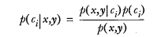

# 朴素贝叶斯 概述
贝叶斯分类是一类分类算法的总称，这类算法均以贝叶斯定理为基础，故统称为贝叶斯分


# 贝叶斯理论
假设有一个数据集，数据集分布如下：


我们现在用 p1(x,y) 表示数据点 (x,y) 属于类别 1（图中用圆点表示的类别）的概率，用 p2(x,y) 表示数据点 (x,y) 属于类别 2（图中三角形表示的类别）的概率，那么对于一个新数据点 (x,y)，可以用下面的规则来判断它的类别
- 如果 p1(x,y) > p2(x,y) ，那么类别为1
- 如果 p2(x,y) > p1(x,y) ，那么类别为2

即是选择高概率对应的类别


# 使用条件概率来分类
用 p1() 和 p2() 只是为了尽可能简化描述，而真正需要计算和比较的是 p(c1|x, y) 和 p(c2|x, y)

具体意义是: 给定某个由 x、y 表示的数据点，那么该数据点来自类别 c1 的概率是多少？数据点来自类别 c2 的概率又是多少

使用上面这些定义，可以定义贝叶斯分类准则为:
- 如果 P(c1|x, y) > P(c2|x, y), 那么属于类别 c1
- 如果 P(c2|x, y) > P(c1|x, y), 那么属于类别 c2

公式如下：  



- p(Ci|x,y) 表示x, y 点来自 Ci 类别的概率

计算方式
- P(Ci) Ci 类别占所有类别的概率，计算方式是 属于 Ci 类别的点/所有点
- P(x,y|Ci)， Ci 类中出现 x,y 的概率，计算方式 Ci 中 x,y 点/Ci 中所有的点，同时乘于类别 Ci 类别出现的概率
- P(x, y) x， y 点出现的概率，计算方式 x,y 点/所有的点


# 朴素贝叶斯在文档分类的工作原理

目标：给定文档出现的词条(x, y)，确定改文档的分类 c
```
提取所有文档中的词条并进行去重
获取文档的所有类别(所有 c)
计算每个类别中的文档数目(每个类别下 x, y 的数目)
对每篇训练文档: 
    对每个类别: 
        如果词条出现在文档中-->增加该词条的计数值（for循环或者矩阵相加）
        增加所有词条的计数值（此类别下词条总数）
对每个类别: 
    对每个词条: 
        将该词条的数目除以总词条数目得到的条件概率（P(词条|类别)）
返回该文档属于每个类别的条件概率（P(类别|文档的所有词条)）

根据贝叶斯公式，需要计算（x, y） 表示的是某个单词

- P(Ci) Ci 类别占所有类别的概率，分别统计侮辱性和非侮辱性的概率
- P(x,y|Ci)， 在侮辱性和非侮辱性类别中的条件下，统计每个单词出现的概率，同时乘上这个类别出现的概率
- P(x, y) 计算每个单词出现的概率（可以对  P(x,y|Ci) 累加得到）

```


## 实战项目1
[使用朴素贝叶斯识别侮辱性言论](./insulting_word_classify.py)
